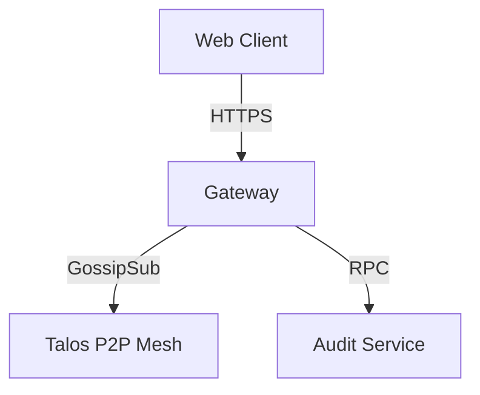

# Talos Gateway Service

**Repo Role**: High-availability ingress/egress point for the Talos Network to the outside world.

## Abstract
The Talos Gateway acts as the bridge between standard HTTPS/WebSocket clients and the P2P Talos Network. It provides destination routing, protocol translation, and DDOS protection for the underlying mesh.

## Introduction
Not every agent can run a full Talos node. The Gateway allows lightweight clients to connect to the network via standard web protocols while maintaining end-to-end encryption properties where possible.

## System Architecture



## Technical Design
### Modules
- **router**: Message routing logic.
- **auth**: Client authentication.
- **p2p**: Libp2p integration.

### Data Formats
- **Input**: JSON-RPC over HTTP/WS.
- **Output**: Binary Talos Envelopes.

## Evaluation
Evaluation: N/A for this repo (See: `talos-dashboard` for network stats).

## Usage
### Quickstart
```bash
./scripts/start.sh
```

### Common Workflows
1.  **Connect Client**: POST to `/api/v1/message`.

## Operational Interface
*   `make test`: Run unit tests.
*   `scripts/test.sh`: CI entrypoint.

## Security Considerations
*   **Threat Model**: Public-facing ingress point.
*   **Guarantees**:
    *   **Rate Limiting**: Per-IP and per-key limits.

## References
1.  [Talos Docs](../talos-docs/README.md)
