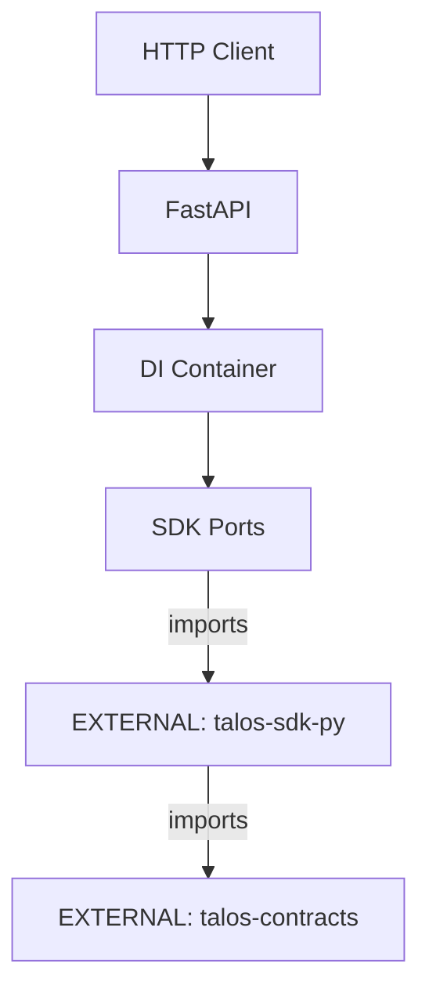

# talos-gateway Architecture

## Overview
`talos-gateway` is the FastAPI-based HTTP entry point for the Talos network, handling event logging and querying.

## Internal Components

| Component | Purpose |
|-----------|---------|
| `main.py` | FastAPI application entry point |
| `bootstrap.py` | DI container setup |
| `audit.py` | Audit event handlers |

## External Dependencies

| Dependency | Type | Usage |
|------------|------|-------|
| `[EXTERNAL]` talos-sdk-py | PyPI | Ports, Adapters, DI container |
| `[EXTERNAL]` talos-contracts | PyPI | Cursor derivation, event schemas |

## API Endpoints

| Endpoint | Method | Purpose |
|----------|--------|---------|
| `/api/gateway/status` | GET | Health check |
| `/api/events` | GET | Query audit events |
| `/api/events/log` | POST | Log new audit event |

## Environment Variables

| Variable | Purpose |
|----------|---------|
| `TALOS_ENV` | Environment mode (test/production) |
| `TALOS_RUN_ID` | Test isolation identifier |
| `TALOS_DB_PATH` | Database file path |

## Boundary Rules
- ✅ Import from talos-sdk-py for ports/adapters
- ✅ Import from talos-contracts for cursor/schemas
- ❌ No contract logic reimplementation

## Data Flow

